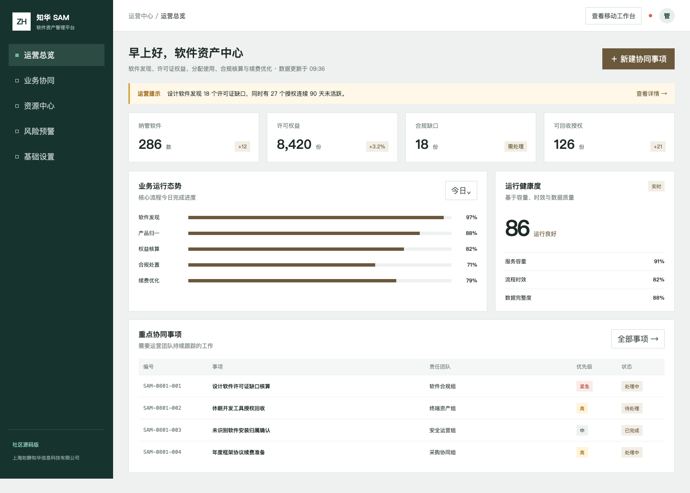
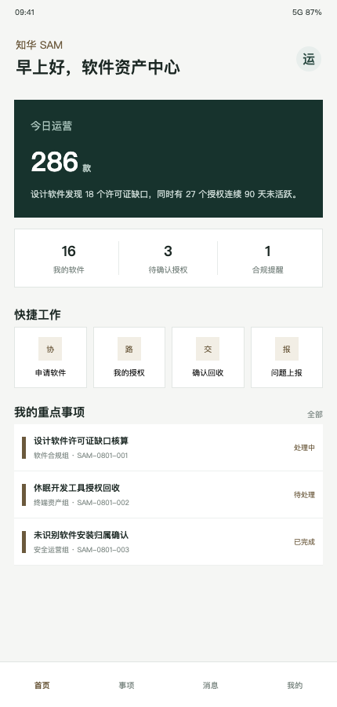

# ZhuaTech SAM：让软件安装、授权权益与真实使用情况对得上

软件资产管理（Software Asset Management）社区源码版，由 **上海如静知华信息科技有限公司** 发布。

项目主页：[https://www.zhuatech.cn/](https://www.zhuatech.cn/)

> 本工程仅能用于个人非商业学习交流，不得商用。企业内部生产、商业部署、SaaS、有偿交付或其他获利使用，需要我方书面授权。

## 为什么做这个项目

企业的软件资产往往分散在终端发现、采购合同、许可证分配和人工台账中。ZhuaTech SAM 用一个可运行的前后端分离样例演示“发现—归一—权益核算—合规处置—续费优化”主线，同时为员工提供软件申请和授权确认 H5 工作台。

## 管理端：看见许可证头寸



页面展示纳管软件、许可权益、合规缺口、可回收授权以及合规事项。专用接口可计算：

```text
有效需求 = 已分配许可 + 未识别安装
可回收授权 = max(已分配许可 - 90 天活跃数, 0)
财务敞口 = max(有效需求 - 采购许可, 0) × 单位成本
```

返回状态包括 `COMPLIANT`、`OPTIMIZE` 和 `NON_COMPLIANT`，只作为学习演示，不能替代厂商合同解释、审计意见或正式合规结论。

## 用户端：完成软件与授权动作



用户可从移动端进入软件申请、我的授权、回收确认和问题上报，后续可扩展应用商店、自动部署和审批集成。

## 代码里已经有

- Java 21 + Spring Boot 4 后端，业务包 `cn.zhuatech.sam`。
- Spring Security 角色隔离与本地演示账号。
- JPA + MySQL 数据访问基线，测试环境使用 H2。
- Vue 3 + Vite 管理端和响应式 H5。
- 许可证头寸、运营风险、事项工作台接口及集成测试。
- Docker Compose、CI、贡献规范、安全策略和双微信咨询入口。

## 5 分钟运行

```bash
cp .env.example .env
docker compose up --build
```

打开 `http://localhost:8090`。本地演示账号：

| 角色 | 用户名 | 密码 |
| --- | --- | --- |
| 管理员 | `admin` | `admin123` |
| 操作员 | `operator` | `operator123` |

不得将默认凭据用于联网环境。独立开发可运行 `mvn spring-boot:run` 与 `npm install && npm run dev`。接口和架构细节分别见 [docs/API.md](docs/API.md) 与 [docs/ARCHITECTURE.md](docs/ARCHITECTURE.md)。

## 许可不是 MIT

本项目采用 [ZhuaTech Community Source License 1.0（个人非商业版）](LICENSE)，含非商业限制，属于 source-available 社区源码，不是 OSI 认可的开源许可证。个人可按条款学习、研究与非商业修改；商业授权、生产部署和深度定制请联系知华科技。

## 获取支持与定制

知华科技（上海如静知华信息科技有限公司）提供软件资产管理、企业信息化、私有化部署、系统集成和二次开发服务。

- 官网：[https://www.zhuatech.cn/](https://www.zhuatech.cn/)
- 微信：以下两个二维码均可咨询。

<p align="center">&nbsp;&nbsp;&nbsp;&nbsp;</p>

## 数据安全

示例数据均为虚构内容，仓库不应出现真实采购合同、软件密钥、员工设备信息、令牌、私钥或生产凭据。发现安全问题请遵循 [SECURITY.md](SECURITY.md) 私下报告。

关键词：知华科技 SAM、软件资产管理系统、许可证合规管理、软件盘点、授权回收、Java SAM、Spring Boot 软件资产、Vue 管理后台、上海软件定制。

## 许可证回收建议

新增 `POST /api/sam/insights/license-reclamation`。接口根据已购授权、活跃席位、长期闲置席位、安全储备和续费单价，计算可安全回收数量、预计续费节省，并返回 `RECLAIM`、`REVIEW` 或 `HOLD`，帮助资产管理员在避免授权短缺的前提下降低软件成本。

## 企业级软件许可证合规签证

新增 `POST /api/enterprise/sam/license-compliance-attestation`，统一检查产品标准化、权益证明、安装消耗、禁止版本、审计责任和合同条款，返回 `ATTEST / REMEDIATE / BLOCKED`。详见 [合规签证说明](docs/ENTERPRISE_LICENSE_ATTESTATION.md)。
